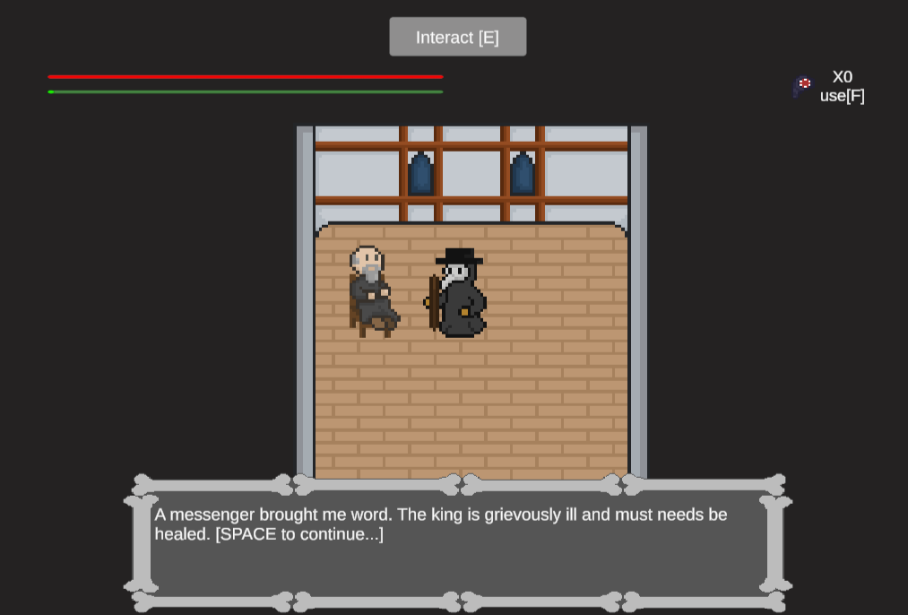
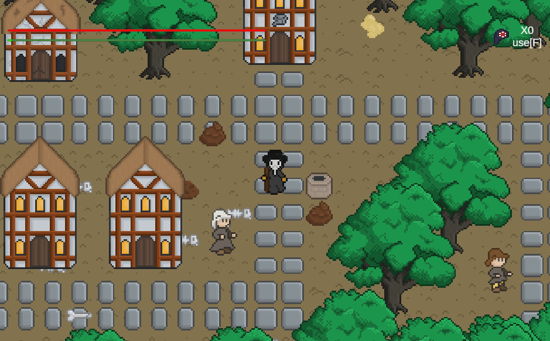
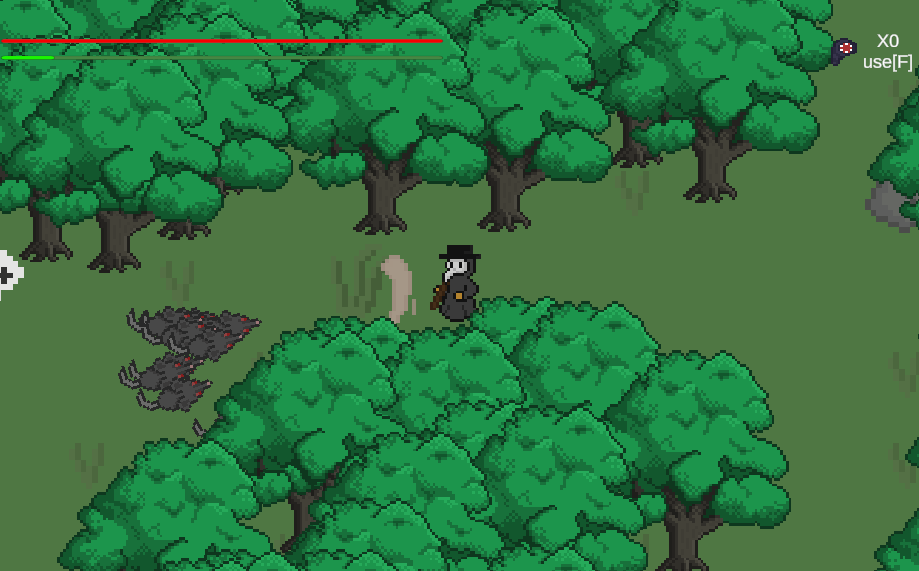
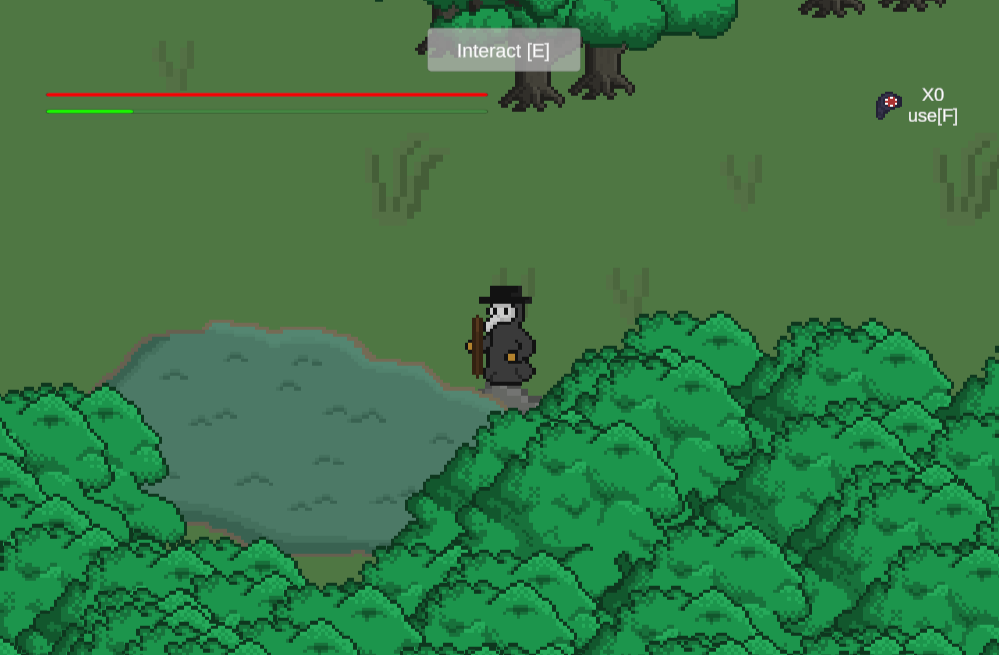
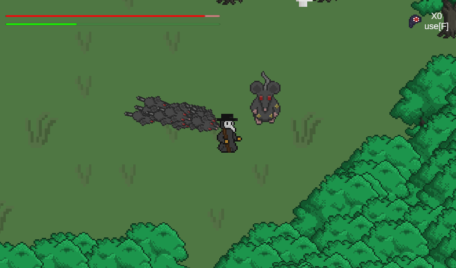
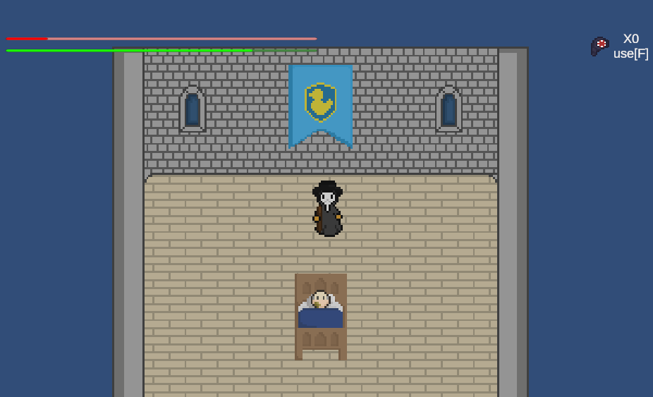

# Plague Doctor 
# This game was a submission for Abyssal's Pixel Game Jame #12.
# ​Rated #1. https://itch.io/jam/abyssals-pixel-game-jam-12

**Plague Doctor** is a dark 2D top-down action RPG set during the plague era. You play as a masked doctor on a quest to reach the infected king. Navigate through a disease-ridden city filled with hostile rats, sick citizens, and environmental dangers — all while managing your own health and infection.
Play it here: [Plague Doctor](https://fsf-gaming-studio.itch.io/plague-doctor)

## Screenshots

## Features

- Combat system with melee attack
- Health and infection management
- Enemy AI, including a boss enemy
- Dialog system for NPC interactions
- Interactive environment with objects, doors, and NPCs
- Cutscene and gameplay state separation
- Smooth scene transitions
- Y-axis-based sprite sorting for proper rendering depth

## How to Play
 
| Action            | Control                    |
|-------------------|----------------------------|
| Move              | W, A, S, D                 |
| Look / Aim        | Mouse position             |
| Attack            | Left Mouse Button (LMB)    |
| Interact          | E                          |
| Use leech         | F                          |

- The character always looks toward the mouse pointer.
- Interactable objects show prompts when in range.
- Infection builds near enemies. Use leeches to reduce it.
- Heath restores over time.

## Project Structure

### Player
- `PlayerMovement.cs` – Handles keyboard input and movement
- `PlayerCombat.cs` – Manages melee attack and shield block
- `PlayerHealth.cs` – Tracks health and infection values
- `AttackHitBox.cs` – Handles hit detection for attacks

### Enemies
- `Enemy.cs`, `EnemyAI.cs`, `FatRatAI.cs` – Core enemy behavior and boss logic

### Interaction
- `IInteractable.cs` – Interface for interactive objects
- `Door.cs` – Scene transition logic via doors
- `PlayerInteracter.cs` – Handles interaction range and detection
- `Sea.cs` – Special environmental interaction
- `DialogManager.cs`, `DialogData.cs` – Dialog system architecture
- `NPCs/*.cs` – Scripts for individual NPCs and their dialog

### Systems
- `GameManager.cs` – Central game logic controller
- `GameState.cs` – Manages gameplay and cutscene state switching
- `SceneTransitionManager.cs` – Manages scene change effects
- `SpawnManager.cs` – Controls enemy or object spawning
- `BoundaryTree.cs`, `BoundaryTreeSort.cs` – Used for s

### UI
- `MainMenu.cs` – Controls the title screen and menu navigation
- `YSorter.cs` – Sorts sprites by Y-axis position for depth layering

## Project Status

This is a working prototype developed during a 48-hour GameJam. The goal was to create a playable demo with complete core mechanics.

